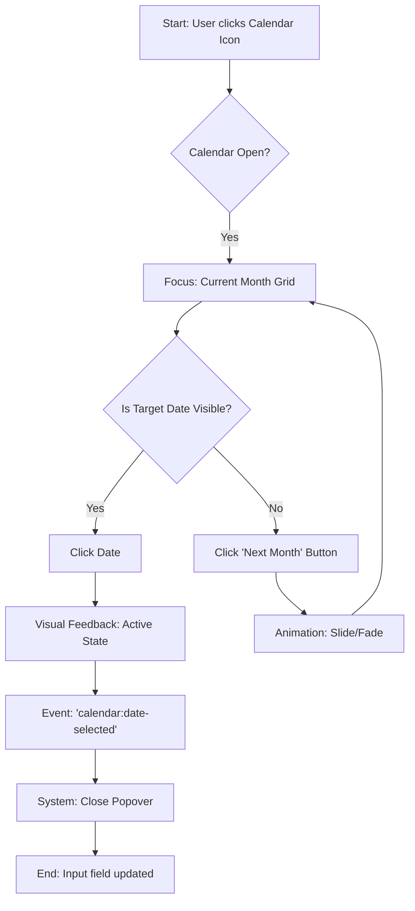
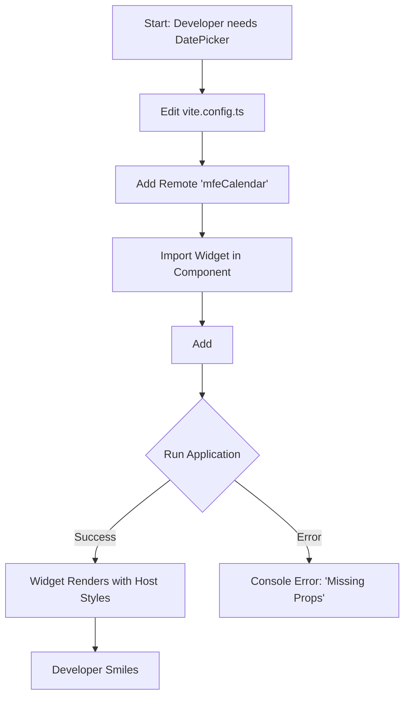

---
stepsCompleted:
  - 1
  - 2
  - 3
  - 4
  - 5
  - 6
  - 7
  - 8
  - 9
  - 10
  - 11
  - 12
  - 13
  - 14
inputDocuments:
  - _bmad-output/planning-artifacts/prd.md
lastStep: 14
status: complete
---

# UX Design Specification Siesa-Agents

**Author:** SiesaTeam
**Date:** 2026-02-02

---

<!-- UX design content will be appended sequentially through collaborative workflow steps -->

## Executive Summary

### Project Vision

To create a standalone Calendar Microfrontend (MFE) that serves as a reusable, independent widget for date selection within the Siesa-Agents ecosystem. This widget will expose a calendar grid, navigation controls, and handle date selection logic, seamlessly integrating with other microfrontends via Module Federation and standard browser events.

### Target Users

**End Users (Laura - HR Manager):**
Business users interacting with Siesa applications who need to view calendars and select dates efficiently. They prioritize speed, clarity, and familiarity with the system's look and feel.

**Developers (David - Frontend Engineer):**
Engineering teams integrating date selection capabilities into their specific microfrontends. They prioritize ease of integration, API stability, and styling consistency.

### Key Design Challenges

1.  **Seamless Visual Integration:** As a federated module, the calendar must look and behave indistinguishably from the host application's native components, avoiding any "iframe-like" visual dissonance.
2.  **Strict Performance Budgets:** The widget must load instantly (<200ms) and remain under 50KB to not degrade the host application's performance.
3.  **Universal Accessibility:** As a core utility, it must meet WCAG 2.1 AA standards, supporting full keyboard navigation and screen readers across various host contexts.

### Design Opportunities

1.  **"Invisible" Integration:** Creating an experience so native that users don't realize they are crossing a microfrontend boundary.
2.  **Self-Healing consistency:** leveraging the federated nature to deploy UX improvements (like leap year fixes) instantly across all consuming apps.
3.  **Low-Friction Developer Experience:** Designing the "API surface" (props, events) to be as intuitive as the UI surface, ensuring correct implementation by limiting configuration complexity.

## Core User Experience

### Defining Experience

The core experience centers on a single, atomic interaction: **The Confirmation of Time**. Users enter the calendar not to browse, but to secure a specific date. The experience must be:
1.  **Instantaneous:** The calendar appears immediately when requested.
2.  **Cognitively Low-Load:** The grid layout must be standard and predictable (Monday/Sunday start standard).
3.  **Decisive:** A single click should suffice to complete the task.

### Platform Strategy

**Primary Platform:** Desktop and Mobile Web (modern browsers).
**Context:** Embedded Microfrontend.
-   **Responsiveness:** The widget acts like a fluid container, filling the space provided by the host application (e.g., a modal, a dropdown, or a full page section).
-   **Interaction Model:** Hybrid (Mouse + Touch). Buttons must be large enough for touch targets (min 44px for critical actions) while dense enough for desktop utility.
-   **Integration:** Must operate flawlessly within Shadow DOM or Scoped CSS to ensure isolation.

### Effortless Interactions

1.  **"One-Click" Selection:** 80% usage is selecting a date in the current or next month. This path must be zero-friction.
2.  **Smart Anchoring:** The calendar opens focused on the currently selected date or today's date if empty.
3.  **Fluid Navigation:** Month transitions should be instantaneous (client-side state), with no loading spinners.

### Critical Success Moments

1.  **The "It Just Works" Moment (Developer):** When a developer drops `<CalendarWidget />` into their layout, and it renders perfectly matching their app's theme without configuration.
2.  **The "Thoughtless" Fill (User):** A user clicking an input, picking a date, and moving to the next field in under 2 seconds. If they pause to interpret the UI, we have failed.

### Experience Principles

1.  **Isolation without Alienation:** Technical isolation (MFE) must not lead to visual alienation. The widget complies strictly with the Host's Design System.
2.  **Speed is a Feature:** Animation and logic execution must be faster than human reaction time (<100ms response).
3.  **Universal Access:** The calendar is a utility, not art. It must be usable by robots (automated testing), screen readers, and keyboard warriors equally.

## Desired Emotional Response

### Primary Emotional Goals

**Confidence & Flow.**
Users should feel a subtle sense of **competence**. The calendar shouldn't demand attention; it should simply "be there" and "work". The primary emotion is the absence of frustration—a state of **Flow** where the tool is transparent to the task.

### Emotional Journey Mapping

1.  **The Summon (Trigger):**
    *   *Expectation:* "I hope this doesn't break my flow or cover what I'm reading."
    *   *Reality:* Calendar appears instantly, positioned correctly.
    *   *Feeling:* **Reassurance.** (It's clean, it looks native).

2.  **The Hunt (Navigation):**
    *   *Action:* Looking for "Next Month".
    *   *Reality:* Controls are obvious, clicks respond instantly.
    *   *Feeling:* **Control.** (The interface obeys immediately).

3.  **The Kill (Selection):**
    *   *Action:* Clicking the date.
    *   *Reality:* A satisfying visual "thud" (active state) followed by immediate dismissal (if configured) or value update.
    *   *Feeling:* **Completion.** (Task done, clear feedback).

### Micro-Emotions

*   **Trust:** Derived from the visual consistency with the `siesa-ui-kit`. "This belongs here."
*   **Safety:** Derived from clear "Disabled" states for invalid dates. "I can't make a mistake."
*   **Delight:** Derived from subtle micro-interactions (e.g., a smooth fade when switching months) that feel polished but not distracting.

### Design Implications

1.  **For Confidence:** Use strong, high-contrast colors (Primary Brand Color) for the *Selected State*. Use unambiguous styles for *Today* vs *Selected*.
2.  **For Safety:** Clearly gray out and disable interaction on dates outside the valid range. Show a "not-allowed" cursor.
3.  **For Flow:** Eliminate "bounce" or layout shifts when changing months (e.g., if row count changes from 5 to 6, the container height should remain stable or animate smoothly).

### Emotional Design Principles

1.  **Do No Harm:** The calendar must never block the user from their primary task (e.g., covering the submit button on mobile).
2.  **Clarity over Style:** If a cool animation slows down the "time to select" by 100ms, kill the animation.
3.  **Silent Partner:** The best calendar is one the user doesn't remember using. It should be invisible in its efficiency.

## UX Pattern Analysis & Inspiration

### Inspiring Products Analysis

*   **Google Calendar (Web):**
    *   *Why:* Mastery of density. It shows a lot of data without feeling crowded.
    *   *Lesson:* Use "ghost" colors (light grays) for days outside the current month to maintain grid structure without cognitive load.
*   **Linear (App):**
    *   *Why:* Unapologetic focus on speed and keyboard utility.
    *   *Lesson:* Full keyboard support isn't an "extra"—it's the primary way power users will interact. Arrow keys `Right/Left/Up/Down` must work natively.
*   **Airbnb (Web):**
    *   *Why:* Visual clarity and touch-readiness.
    *   *Lesson:* Ample white space and rounded selection indicators create a verified "friendly/safe" feel.

### Transferable UX Patterns

**Interaction Patterns:**
1.  **"Click-Outside-to-Dismiss":** Standard popover behavior reduces the need for explicit "Cancel" buttons, de-cluttering the UI.
2.  **"Smart Input Parsing" (Future):** If a user types "Next Friday", the calendar (or input) understands. (Note for future, but design the visual input to allow text entry).

**Visual Patterns:**
1.  **Rounded Selection:** Use generic circles for selected dates (Airbnb style) rather than squares, as circles differentiate purely from the rectangular grid.
2.  **Ghosted Navigation:** Prev/Next buttons should be subtle until hovered/focused, keeping focus on the dates.

### Anti-Patterns to Avoid

1.  **"Scroll Jacking" Month Transitions:** Don't use scroll events to switch months; it's too sensitive on trackpads. Stick to explicit clicks or distinct swipes.
2.  **The "Combobox Year":** Selecting a year from a dropdown of 100 items is bad. Use a "Year View" grid or allow typing `2027`.
3.  **Tiny Targets:** Dates are often small numbers. The *clickable area* must be larger than the visible number.

### Design Inspiration Strategy

**What to Adopt:**
*   **Radix UI / Shadcn Primitives:** Adopt the underlying accessibility primitives (Focus management, ARIA roles) from these standard libraries.
*   **Linear's Keyboard Model:** Adopt strict arrow-key navigation logic.

**What to Adapt:**
*   **Siesa Visuals:** Adapt the "Rounded Selection" pattern to use the exact `primary` color token from `siesa-ui-kit`.

**What to Avoid:**
*   **Native Browser Inputs:** Avoid `<input type="date">` for the widget's internal logic, as we need consistent styling that native inputs don't offer.

## Design System Foundation

### Design System Choice

**Existing System: siesa-ui-kit** (Compliance Level: Mandatory).
We will strictly adhere to the `siesa-ui-kit` as defined in the company standards (`frontend-standards.md`). Where specific complex primitives (like the Calendar grid logic) are missing, we will use **Shadcn UI / Radix primitives** as the headless foundation, styled to match Siesa tokens.

### Rationale for Selection

1.  **Mandate:** Company policy (P0 Rule) requires `siesa-ui-kit` to ensure the MFE looks native to the host.
2.  **Federation Safety:** Using the shared UI kit ensures that CSS variables and tokens are available at runtime in the host environment.
3.  **Accessibility**: Radix primitives (via Shadcn) provide the best-in-class keyboard/screen-reader support without reinventing the wheel.

### Implementation Approach

1.  **Atomic Composition:** The calendar will be built by composing existing Siesa atoms:
    *   `Button` (variant: ghost) for date cells.
    *   `IconButton` for navigation.
    *   `Typography` for headers.
2.  **Token Usage:** We will NOT write hardcoded hex values. We will use CSS variables (e.g., `var(--primary)`, `var(--radius)`) to ensure the calendar respects the host's theme (Light/Dark mode).

### Customization Strategy

*   **The Grid Component:** This is a new "organism" not present in the kit. We will define a layout container that respects Siesa's spacing tokens (`gap-2`, `p-4`).
*   **State Styling:**
    *   *Selected:* `bg-primary text-primary-foreground` (Shadcn standard mapped to Siesa).
    *   *Today:* `text-primary font-bold`.
    *   *Outside Month:* `text-muted-foreground opacity-50`.

## Detailed Experience Mechanics

### 2.1 Defining Experience

**"The Atomic Commitment"**
The defining experience is the `onClick` event of a date cell. This micro-moment must feel substantial yet effortless. It represents the user telling the system "This is the day".

### 2.2 User Mental Model

*   **The Wall Calendar:** Users visualize time as a 2D grid of 7 columns (days of week).
*   **Sequential Logic:** Users expect "Previous Button" to go to the past (Left) and "Next Button" to go to the future (Right).
*   **Finite Choice:** Users see the month as a discrete set of ~30 choices, not an infinite scroll.

### 2.3 Success Criteria

1.  **Zero-Instruction:** A user should never need to read a tooltip to know how to navigate or select.
2.  **State Clarity:** It must be impossible to confuse "Today" with "Selected Day".
3.  **Boundary Confidence:** When a user hits the limit (min/max date), the UI must communicate it visually (dimmed opacity) immediately, preventing the click.

### 2.4 Novel UX Patterns

**None.** We are deliberately choosing **Established Patterns** to minimize cognitive load.
*   **Why:** A date picker is a utility. Innovation here usually leads to confusion (e.g., dial-based circular pickers). We adhere to the standard specialized grid.

### 2.5 Experience Mechanics

1.  **Initiation:**
    *   *Trigger:* User focuses an Input field or clicks a Calendar Icon.
    *   *System:* Popover opens immediately below/above the trigger, Z-indexed above all content. Focus moves to the "Selected Date" or "Today".

2.  **Interaction:**
    *   *Navigation:* Click `<` or `>` to switch months. Grid slides or instantly replaces.
    *   *Selection:* User clicks a cell.
    *   *Hover:* Cell background changes to `accent` (Siesa muted color).

3.  **Feedback:**
    *   *Visual:* The clicked cell briefly flashes "active" state.
    *   *Data:* The input field updates with the formatted string (e.g., "DD/MM/YYYY").
    *   *System:* Popover closes (unless configured `closeOnSelect={false}`).

4.  **Completion:**
    *   Focus returns to the input field or moves to the next form element.

## Visual Design Foundation

### Color System

**Token-Based Architecture**
We do not define new colors. We consume the semantic tokens from the host application to ensure perfect theming support (Dark/Light mode).

*   **Surface:** `bg-popover text-popover-foreground` (The container).
*   **Selected Day:** `bg-primary text-primary-foreground`.
*   **Today's Date:** `text-accent-foreground` (if not selected) with `bg-accent/20`.
*   **Hover State:** `bg-accent text-accent-foreground`.
*   **Muted Elements:** `text-muted-foreground` (Days of week headers).

### Typography System

**Hierarchy**
*   **Month/Year Title:** `text-sm font-semibold` (Centered or Start-aligned).
*   **Days of Week:** `text-[0.8rem] text-muted-foreground font-normal`.
*   **Date Cells:** `text-sm font-normal` (Tabular nums if possible for alignment, though rare in sans-serif).

### Spacing & Layout Foundation

**Density: Compact**
*   **Cell Size:** Fixed `h-9 w-9` (36px) per date cell to ensure touch target > 32px inner + padding, while keeping the widget compact (~252px width).
*   **Grid Gap:** `gap-1` (4px) or `gap-0` with internal padding.
*   **Popover Padding:** `p-3` (12px) standard padding.

### Accessibility Considerations

*   **Focus Ring:** Navigation buttons and Date cells must show a visible `ring-2 ring-offset-2` on keyboard focus.
*   **Contrast:** `primary` vs `primary-foreground` is guaranteed compliant by the system.
*   **Scaling:** UI must respond to browser zoom without breaking the grid (using `rem` units for width/height).

## Design Direction Decision

### Design Directions Explored

1.  **Classic Enterprise:** High density, visible borders, "Database-like" feel.
    *   *Pros:* Maximizes data density. Matches legacy ERPs.
    *   *Cons:* Feels outdated, poor touch targets.
2.  **Modern Fluid (Siesa Standard):** Rounded corners, ghost buttons, clean hierarchy.
    *   *Pros:* Matches `siesa-ui-kit`, feels "SaaS-native", good balance of density and touch.
    *   *Cons:* None (Native fit).
3.  **Minimalist:** Type-heavy, removal of almost all chrome.
    *   *Pros:* Very clean.
    *   *Cons:* Harder to scan for quick data entry; lack of affordance for navigation.

### Chosen Direction

**Option 2: Modern Fluid (Siesa Standard)**

### Design Rationale

1.  **System Coherence:** It is the only option that naturally extends the host application without looking like a third-party plugin.
2.  **Usability:** The use of distinct background shapes (rounded squares) for selection provides better affordance than just text color (Minimalist) or hard borders (Classic).
3.  **Modernity:** Rounded corners (`radius-md`) and subtle shadows align with current web standards and user expectations for "friendly" software.

### Implementation Approach

*   **Corner Radius:** `0.5rem` (8px) for container, `0.375rem` (6px) for inner buttons.
*   **Shadows:** `shadow-lg` for the floating popover to ensure lift over host content.
*   **Animation:** fast `0.2s` ease-out transition for month sliding (if implemented) or simple fade.

## User Journey Flows

### Journey 1: The End User Selection (Laura)

**Goal:** Select a specific date in a future month (April 2026).
**Context:** HR Portal form.

### Journey 2: The Developer Integration (David)

**Goal:** Add Calendar to "Project Manager" App.
**Context:** IDE code editing.

### Journey Patterns

1.  **Instant-Close Pattern:** The default behavior for "Selection" is to close the widget immediately. This reduces click-fatigue (no "OK" button needed).
2.  **Validation-at-Source:** If a date is invalid (e.g., past date), it is **unclickable** and visually distinct, rather than clickable-then-error.

### Flow Optimization Principles

1.  **Minimize Clicks:** No "Month Picker" modal intermediate step unless user clicks the Month Title (post-MVP).
2.  **Forgiving Inputs:** If user types in the input, the calendar syncs its state to that date.

## Component Strategy

### siesa-ui-kit Components (Priority 1)

**Mandatory Usage:**
1.  **Button:** Used for day cells (`variant="ghost"`) and navigation (`variant="outline"` or `ghost`).
    *   *Why:* Ensures focus states and hover effects match the system.
2.  **Typography / Text:** Used for "Febrero 2026" and "Lu/Ma/Mi".
    *   *Why:* Ensures font-family and weight consistency.
3.  **Popover (if available):** Used for the floating container logic.

### Design System Components (Priority 2)

**From Shadcn UI (if not in Siesa):**
1.  **cn (utility):** For class merging.
2.  **Lucide Icons:** `ChevronLeft`, `ChevronRight` for navigation arrows.

### Custom Components (Priority 3)

#### `<CalendarWidget />` (The Application)
*   **Decision:** **Create as new domain component**. This is the purpose of this project.
*   **Purpose:** A self-contained date picker module.
*   **Anatomy:**
    *   `CalendarHeader`: Controls navigation (Prev/Next). Label: "Febrero 2026".
    *   `CalendarGrid`: The 7x6 matrix of buttons.
*   **States:**
    *   *Idle:* White background.
    *   *Selected:* Background `primary`, Text `primary-foreground`.
    *   *Disabled:* Opacity 50%, no pointer events.
*   **Language:**
    *   Month names: "Enero", "Febrero", etc.
    *   Weekdays: "Lu", "Ma", "Mi", "Ju", "Vi", "Sa", "Do".

### Component Implementation Strategy

1.  **Composition:** We will compose `Button`s into a Grid. We will NOT use a 3rd party library like `react-day-picker` unless absolutely necessary for complex logic (ranges), to keep bundle size small (<50KB). For MVP (single date), native `Date` math is sufficient and lighter.
2.  **Localization:** Information will be derived from `Intl.DateTimeFormat` with locale `es-ES`.
3.  **Classes:** Use `tailwind-merge` to allow host apps to override styles if needed via `className` prop.

### Implementation Roadmap

**Phase 1 - The Core (Week 1):**
*   Implement `CalendarGrid` logic (generating days).
*   Implement `CalendarHeader` navigation.
*   Style using Siesa tokens.

**Phase 2 - The Wrapper (Week 1):**
*   Expose via Module Federation (`remoteEntry.js`).
*   Implement `onDateSelected` event emission.

**Phase 3 - Polish:**
*   Keyboard navigation (Arrow keys).
*   Focus trap (for Popover mode).

## UX Consistency Patterns

### Button Hierarchy

*   **Navigation Buttons (< >):** `Ghost` variant. They should be visible but low-noise.
*   **Date Cells:** `Ghost` variant (rectangular or rounded). High inter-element spacing (0px gap, internal padding) to form a cohesive grid.
*   **Selected Day:** `Primary` variant (Solid background). This is the only "Primary" action intensity in the UI.

### Navigation Patterns

*   **Linear Time:** Navigation is strictly linear (Month-by-Month).
*   **Looping (Focus):** Tab navigation loops inside the widget while it is open (Focus Trap).
*   **Escape Hatch:** `Esc` key closes the widget without selection.

### Feedback Patterns

*   **Hover:** Immediate `bg-accent` color change (0ms delay).
*   **Active/Input:** `bg-primary/20` while mouse is down (active state) to provide tactile click feel.
*   **Error:** If a user tries to type an invalid date (in the host input) and opens the calendar, the calendar defaults to "Today" rather than breaking.

### Mobile Considerations

*   **Touch Targets:** All clickable cells have a minimum hit area of 40x40px (via padding), even if the visual text is small.
*   **Placement:** On mobile sizes, the popover should ideally "sheet" from the bottom or center, but for this Federated MVP, we will stick to Popover positioning with `auto` placement (flipping if near edge).

## Responsive Design & Accessibility

### Responsive Strategy

**Container-Driven Design**
As a Microfrontend widget, we cannot rely on the viewport size (`media queries`) because the widget might be placed in a narrow sidebar on a Desktop screen.
*   **Strategy:** Fluid width with Constraints.
    *   `w-full` to fill the parent container.
    *   `max-w-[280px]` (standard) or `max-w-[320px]` (touch) to prevent awkward stretching.
    *   `mx-auto` to center within the host space.

### Accessibility Strategy

**Compliance Level: WCAG 2.1 AA (Mandatory)**

**Keyboard Interaction Model (The "Grid" Pattern):**
1.  **Tab:** Enters the widget. Focus lands on "Today" or "Selected Date".
2.  **Arrow Keys:**
    *   `Left`: Prev Day.
    *   `Right`: Next Day.
    *   `Up`: Prev Week.
    *   `Down`: Next Week.
3.  **Enter/Space:** Select date.
4.  **PageUp/Down:** Switch Month.
5.  **Home/End:** Start/End of Week (or Month).

**Screen Reader Experience:**
*   **Grid:** The days are structured as a `table` (or `role="grid"`) so users can navigate spatially.
*   **Labels:** Each cell must have `aria-label="Monday, February 2, 2026"`.
*   **Status updates:** A hidden `aria-live="polite"` region must announce the new month when changed (e.g., "Showing March 2026").

### Implementation Guidelines

1.  **HTML Structure:** Use `<button>` for days. Never `
` with onClick.
2.  **Focus Management:** When opening the popover, focus MUST move inside. When closing, focus MUST return to the trigger.
3.  **High Contrast:** Ensure the `selected` state has a 3:1 contrast ratio against the background (Siesa `primary` token handles this).
